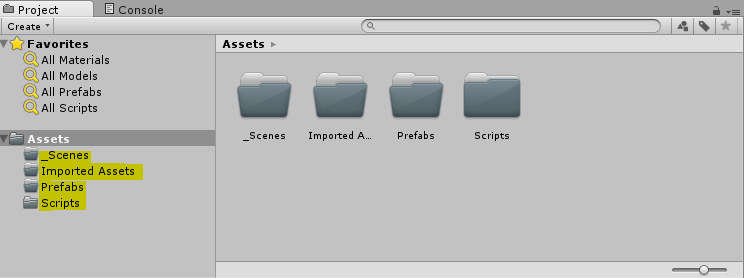
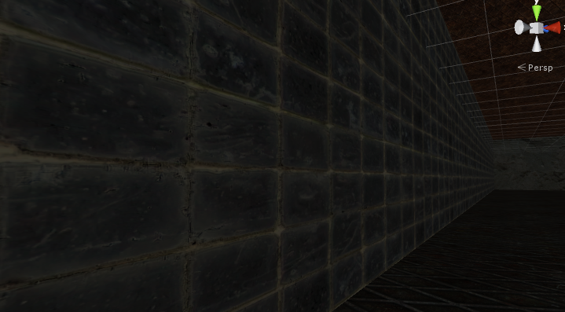
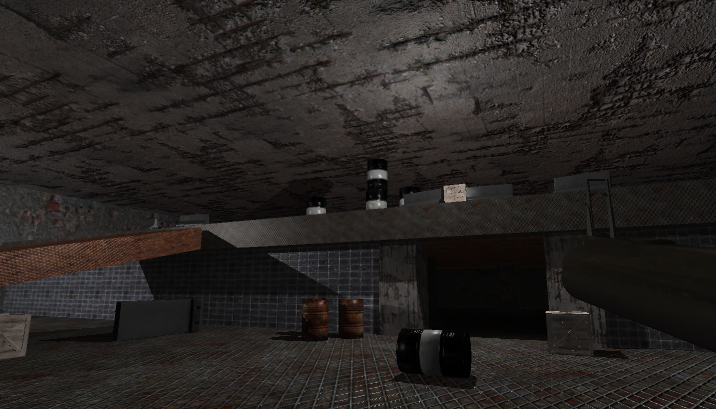

<center>

Codename_Sting
===============
**Desarrollo de un FPS con Unity**    
_Andrés Ortiz Corrales - @demiurgosoft_ 


    

------

    


</center>


<div style="page-break-before:always"></div>

# Introducción
Unity 5 es un _game engine_, es decir, un framework para el desarrollo de videojuegos, como tal posee una estructura similar al resto de motores de desarrollo de juegos y de programación 3D, con el objetivo de facilitar el desarrollo de un videojuego.

Para ello, estos motores cuentan con una serie de herramientas de alto nivel:
* **Motor de renderizado:** Se encarga del dibujado 3D (o 2D), normalmente basado en OpenGL o DirectX, abstrae toda la tarea de dibujado a una programación de alto nivel o editor visual (no confundir con una herramienta de modelado)
* **Motor de física:** La complejidad de los juegos modernos (y capacidad de computación) requiere de un sistema de "simulación" física en los juegos, generalmente para obtener comportamientos realistas de los objetos (gravedad, velocidad, colisiones).
* **API de Scripting:** La lógica del juego se programará en un lenguaje usando la API del _game engine_ y será ejecutada directamente por esta
* **Interfaz de I/O:** Una capa de abstracción sobre la interfaz con los dispositivos del usuario permitirá adaptar el juego a múltiples plataformas y mejorar la compatibilidad con diversos equipos
* **GUI:** Un sistema de interfaz gráfica independiente del renderizado (para menús, botones o elementos visuales 2D)

Además de estos elementos, encontraremos herramientas de audio, animacion e inteligencia artificial entre otras.

> Aunque la mayoría de motores de juegos poseen alguna herramienta de modelado simple, Unity no posee ninguna, por lo que todos los modelos del juego deberán cargarse aparte como assets o estar compuestos de primitivas simples

Generalmente, el game engine consiste en el último paso en el flujo de desarrollo de un videojuego, comenzando por el diseño de este, creación de assets (música, modelos, texturas) y finalmente implementación del juego.

## Unity
[Unity](http://www.unity3d.com/) es un motor de videojuegos lanzado por primera vez en 2005, actualmente en su versión 5.

Su fama se debe a ser realtivamente sencillo de usar, barato y multiplataforma (ordenadores, web, móviles y consolas). Comparándolo con otros motores de juego actuales como [Unreal](https://www.unrealengine.com) o [CryEngine](http://cryengine.com/) Unity nos permitirá desarrollar un videojuego desde 0 mucho más rápido (y barato) a costa de ciertas limitaciones al compararlas con los motores anteriores.

Comparándolo con estos motores, Unity es perfecto para desarrollo de juegos _indie_ en los que la calidad gráfica no sea un factor principal, videojuegos para plataformas móvil (y otras) así como para herramientas de visualización 3D.

La ultima versión de Unity, además, mejoró notablemente el rendimiento y la calidad gráfica de los juegos resultantes, como demuestra la animación [The Blacksmith](https://www.youtube.com/watch?v=G-zLx5JVMVE).

## Estructura de Unity
Unity posee una estructura basada en **GameObjects** y **Components**.


_Estructura de objetos de Unity_

Todo lo que usemos en nuestro juego serán gameObjects, cada gameObject, sin embargo, tendrá distintos componentes que definirán su comportamiento y harán uso de nuestros assets, a lo largo de la guía veremos como usar varios de estos componentes, aquí listamos algunos de los más usados:   
* **Transform:** Es el único componente que se encuentra en todos los gameObjects, define la posición, rotación y escala del objeto, así como su posición en la jerarquía de la escena
* **Mesh Filter && Mesh Renderer:** Estos dos componentes obtendrán un mesh de los assets y lo renderizarán en pantalla junto con las texturas necesarias
* **Rigidbody3D:** Incorpora el elemento al motor físico, de forma que le afectan las fuerzas (usar _rigidbody2D_ para objetos juegos 2D)
* **Collider:** Hay diversos colliders distntos, se encargan de detección de colisiones entre objetos (usar _collider2D_ en juegos 2D)
* **Camera:** Define una cámara del juego
* **Light:** Define una luz
* **Audio Source:** Define un origen de Audio
* **Script:** Este componente nos permite añadir un script nuestro para definir un nuevo componente del objeto


> De esta forma, combinaciones de estos componentes producen diversos objetos de juego (por ejemplo, un mesh de bombilla + una luz creará un objeto bombilla con iluminación)

<div style="page-break-before:always"></div>

# Guía de Proyecto
Para el desarrollo de este proyecto, se usará **Unity 5**, además, se deberá usar el paquete de assets que se descargará junto con este manual.

Comenzaremos creando un nuevo proyecto en Unity (por ejemplo codename_sting), tras familiarizarnos con el entorno creamos los siguientes directorios desde la propia interfaz de Unity (ventana Project):
* \_Scenes
* Scripts
* Prefabs
* Imported Assets

    
_Estructura del Proyecto_

> La interfaz de Unity está compuesta por ventanas, que podemos adaptar a nuestro gusto, si no aparece alguna ventana, es posible ver todas las ventanas (y abirlas) en el menú `windows`

<div style="page-break-before:always"></div>

## Escenario
El juego consistirá en una única escena interior, emulando los juegos fps clásicos

### Elementos principales
Comenzaremos creando un esqueleto de un nivel (Level1) para nuestro FPS, para ello creamos una nueva escena (`File/New Scene`).

En la ventana de **Hierarchy** podemos crear elementos básicos, comenzaremos creando un cubo (`Create/3D Object/Cube`)

Pinchando el cubo, podemos moverlo, rotarlo o escalarlo, bien con las herramientas visuales o modificando sus valores del componente **Transform**


  
_Componente Transform_


>El componente **Transform** se encuentra en todos los _Game Objects_ y nos permite modificar su posición, rotación y escala, así como modificar a sus padres e hijos en la jerarquía

Para crear el esqueleto del escenario, nos basaremos en cubos, luego añadiremos detalles, comenzaremos con el cubo que ya tenemos para formar el suelo, para ello, lo escalamos a [50,1,50], también cambiaremos el nombre a _Floor_. Modificaremos su posición a [0,-3,0], de esta forma quedará un poco por debajo del origen de coordenadas, la rotación la mantenemos a [0,0,0].

Posteriormente, crearemos a nuestro gusto los demás elementos básicos del escenario siguiendo el mismo proceso con cubos, por ejemplo:
1. 4 Paredes (escaladas a [50,15,1]), puestas en los laterales "atravesando" el suelo
2. Un segundo piso, escalado a [25,1,50] y posicionado en una mitad de la habitación, a una altura de 2 (4.5 desde el suelo)
3. Una rampa, escalada a [20,1,6] aproximadamente, y rotada para que tenga una pendiente suave entre los dos pisos
4. 2 Paredes en piso bajo (altura 5), separando la parte tapada por el segundo piso, con un hueco entre ellas
5. Crear 2 columnas en los bordes de las puertas (cubos escalados a [2.5,5,2.5])
7. Finalmente, clonaremos las columnas y añadiremos unas pocas en la habitación interior, podemos además, poner una columna tumbada
    * **Importante** ir cambiando los nombres de los elementos, para diferenciarlos, no importa que sean nombres repetidos

    
_Level1_

     
_Level1: Inner Room_

> Más adelante, clonaremos el suelo para generar un techo, sin embargo, por comodidad trabajaremos así de momento

Es recomendable organizar los elementos en la jerarquía, para ello, vamos a crear un nuevo objeto vacío (`Create/Create Empty`), lo renombramos a Room (comprobar que se encuentra en posición [0,0,0] y arrastraremos todos los elementos que hemos creado dentro de este (no incluir Main Camera ni Directional Light)

> Si un objeto padre en la jerarquía se mueve, rota o escala, Todos sus hijos sufrirán la misma transformación, de esta forma, si movemos el objeto _room_ que acabamos de crear, moveremos la habitación completa

Este escenario corresponderá a un nivel de nuestro juego, puedes modificarlo a tu gusto o crear nuevos niveles de la misma forma. Antes de continuar, guardaremos la escena (`File/Save Scene As...`) en la carpeta **_Scenes** con el nombre **Level1.unity**

### Texturización
Ahora, queremos darle un aspecto más realista a nuestro escenario, para eso, la mejor opción consiste en _texturizar_ los elementos de la escena.

En Unity (y la mayoría de motores gráficos) diversas texturas se asocian a uno o más **materiales**, que definen, no solo el color de la textura, sino el comportamiento de la luz entre otras cosas, estos materiales se asociarán entonces a los elementos el juego que queramos.

Para crear un material, vamos a ir a una **nueva escena** y crearemos un cubo, cargamos la carpeta (`Textures/pattern_243`) en la carpeta Textures del proyecto (arrastando en la ventana Project), vemos que se han cargado 2 texturas.

A continuación creamos un material (botón derecho, create/Material) en la carpeta Materials y asociamos este nuevo material al cubo (arrastrando encima).

Al pinchar el cubo, veremos en el inspector, al final,el nombre de nuestro nuevo material, ahora, asociaremos las texturas a los distintos **Maps** de un material, arrastrando las texturas en los cuadrados correspondientes.

Asociaremos la textura `specular` al map **Albedo** (color base) y la textura `normal` al **Normal map**. Esta última, corresponde a un mapa de normales, que "engañará" al sistema de iluminación para mostrar relieve y reflejos inexistentes (**Bump Mapping**). Normalmente, será necesario indicar a Unity que una textura está configurada para ser un Normal map, unity avisará si no lo está y bastará con pinchar en **Fix Now**


    
_Comparación entre material con y sin normal map_

> La mayoría de materiales proporcionados, poseen una textura correspondiente a albedo, otra a normal map y, en algunos casos, una para metallic y otra para emission


Pinchando en **Shader**, aparecerá un desplegable en el material, que nos permitirá seleccionar un shader, que corresponde a una forma de renderizar un material y permitirá crear muchos tipos distinto de materiales, el shader "estándar" de Unity tiene 2 versiones (Standard y Standard Specular), diferenciadas en la forma de reflejar las luces, con esos dos es posible resolver la mayoría de problemas relacionados con materiales, para necesidades y efectos específicos podemos usar los otros shaders o programar nuestro propio shader mediante un lenguaje de shaders.

**Texturizar level 1**    
Volvamos a la escena Level1 (pinchando dos veces en \_Scenes/level1), y aprovechemos el material que ya hemos creado para texturizar el suelo. Para ello, simplemente arrastramos el material al objeto floor, ya sean en la escena o en la jerarquía

    
_Textura del suelo_

Como vemos, la textura se ha cargado a un tamaño inadecuado para un suelo (la rejilla es enorme) si acercamos la vista, veremos la textura pixelada:    


Para mejorar este aspecto, recurriremos a "repetir" la textura varias veces en suelo, (**Tiling**), para ello, en configuración de textura, vamos a la opción Tiling (Main Maps), debido al gran tamaño del suelo, asignaremos unos valores de 10x10 en tiling (en lugar de 1x1), vemos como la textura se hace más pequeña, hay que tener en cuenta que esta modficación afectará a **todos** los elementos con dicho material (si se quiere un tiling distinto, crear un nuevo material usando las mismas texturas):

     
_Textura del suelo con tiling_

>Aunque el patrón de la textura se repite, desde la posición como jugadores que tendremos (unos 2 metros sobre el suelo) no se aprecia este patrón, y conseguimos mucha mayor calidad en la textura sin aumentar su resolución

A continuación, siguiendo el mismo proceso, texturizamos el resto de elementos de la escena, se propone la siguiente combinación de texturas, pero se puede usar cualquier otra combinación u otros assets distintos (Crear un material distinto por cada elemento de la lista):

* Suelo: pattern 242, tiling 10x10
* Paredes: pattern 173, tiling 6x1
* Paredes interiores: pattern 273, tiling 12x3
* Suelo superior: pattern 241, tiling 8x12
* Rampa: pattern 241, tiling 5x1
* Columnas: pattern 182, tiling 1x2, smoothness 0.2, configurar el color de albedo a un gris claro

> Aunque el suelo superior y la rampa sean la misma textura, el material debe ser distinto, pues se configura con distinto tiling

Finalmente, clonamos el suelo, lo trasladamos hacia arriba para formar el techo y lo texturizamos con un nuevo material con el pattern 182, smoothness 0.2 y tiling 5x5

    
_Level 1 texturizado_

Como vemos, la textura se ve mal en el borde del suelo superior al hacer el tiling, para solucionarlo podemos optar por añadir un cubo nuevo, escalado a [1.2,50,1.2], rotarlo 90 grados en X y ponerlo en el borde (haciendo un saliente), texturizándolo aparte (por ejemplo un nuevo material con pattern243 y tiling 1,30)    


<div style="page-break-before:always"></div>

## Crear nuevos objetos
Para el juego, necesitaremos modelos más complejos que cubos y esferas, para ello, importaremos modelos 3D generados con programas externos como Blender, estos modelos nos servirán para añadir elementos decorativos a la escena e incorporar objetos funcionales al juego.

### Importar modelos 3D
Comenzaremos creando una nueva escena para trabajar cómodamente y creando una nueva carpeta `Metal Barrel` en _Imported Assets_
1. Cargamos el archivo metal_barrel.fbx y todas las texturas .tga de `Models/Metal Barrel` dentro de nuestra nueva carpeta    
2. Creamos la carpeta Textures y Meshes en Metal Barrel (Además de la carpeta Materials que se ha creado automáticamente) y ponemos cada asset en su sitio
3. Cargamos metal_barrel.fbx en la escena
	    
4. Creamos el material **Barrel_Black** y **Barrel_Rust** en Materials (podemos borrar el material por defecto), estos materiales corresponderán a 2 versiones distintas del mismo barril
5. Cargamos en el material Barrel_Black las texturas **diffuse_black** para albedo y **normal_soft_bumps** como normal map
6. Hacemos lo mismo con **diffuse_rust** y **normal_hard_bumps** con el material Barrel_Rust
	* En estos materiales no es necesario configurar nada más, ues las texturas han sido hechas específicamente para el modelo proporcionado
    * Nótese que normal_hard_bumps aprovecha la técnica de bump_mapping para que el barril tenga efectos de golpes
7. Ahora, al cargar el modelo metal_barrel a la escena podemos elegir entre estas dos texturas para hacer barriles distintos (cargando el material deseado en el objeto)
        
    *Metal_Barrel*

### Física: Rigidbody
Estos barriles, a diferencia de nuestro escenario, podrán moverse con los impactos, para ello, haremos uso del motor de física de Unity.

Trabajaremos en nuestra escena con los 2 barriles, crearemos un cubo/suelo de 10x10 debajo de estos a una cierta altura. Además, moveremos la cámara (_Main Camera_) a una posición donde veamos perfectamente los cubos, para la simulación de física debemos comenzar el juego (botón play) y veremos la escena desde la posición de la cámara.

Si iniciamos la escena, veremos los dos barriles flotando sobre el suelo, aún no tienen física. Paramos el juego pulsando el botón play de nuevo (por cada vez que modificáis algo sin parar el juego muere un koala)

Para incluir física en los gameObjects, usaremos el componente **Rigidbody**, para ello, vamos al primer barril, en el inspector le damos a _Add Component_ y seleccionamos Physics/Rigidbody. Vemos que se añade un componente con algunas configuraciones sobre masa, gravedad etc..., la dejamos por defecto, hacemos los mismo en el otro barril y pulsamos play.

Vemos que los barriles se ven afectados por la gravedad y caen, sin embargo, atraviesan el suelo que habíamos creado previamente.

### Colliders
Aunque los barriles ya se ven afectados por la física, no son capaces de detectar las colisiones, para ello se necesitan otros componentes, los **Colliders**

> Los Colliders son simplificaciones de los modelos, pues calcular colisiones entre modelos de mallas es extremadamente costoso para un cálculo de física a tiempo real.

Para añadir un collider a los barriles, pinchamos Add Component/Physics/Box Collider, con esto, estamos generando un detector de colisiones en forma de Caja, de esta forma, con independencia de la complejidad del modelo, la detección de colisiones se realizará como si fuera un cubo

> Todas las primitivas en Unity ya tienen un collider incluido, por lo que el suelo que hemos creado ya es capaz de detectar colisiones

Ahora, podemos cambiar los barriles de sitio y rotación y ejecutar de nuevo para ver como se comportan.

    
_Ejecución de barriles con física_

Podemos observar, que aunque la física es capaz de "emular" un comportamiento realista, los colliders en caja generan comportamientos extraños en los barriles, por ejemplo, podemos apilarlos por sus lados, cuando en realidad rodarían

    
_Barriles apilados mágicamente_

También, un collider se puede editar, cambiando su forma para intentar aproximarlo, evitando los "falsos positivos" o que los modelos se intersecten:

    
_Colliders mal configurados_

**Tipos de Colliders**    
Hay distintos tipos de colliders, que nos permitirán mejorar la aproximación al modelo original usando uno o más colliders, en orden de eficiencia:     
* **Sphere Collider:** Simula una esfera, es el más eficiente, los objetos con este collider rodarán como una pelota.
* **Capsule Collider:** Casi tan eficiente como la esfera, es útil para simular objetos alargados, estos también rodarán (sería una aproximación buena para los barriles)
* **Box Collider:** Entre 2 y 4 veces más costoso que los Sphere Collider, aproxima un objeto a un cubo, estos colliders son muy útiles para la mayoría de objetos y se pueden aplicar varios Box Colliders fácilmente
* **Mesh Collider:** Genera un collider a partir de la malla del objeto, generando una detección de colisiones más realista, sin embargo, es extremadamente costoso, y el numero de polígonos del objeto afectará enormemente al coste de procesar la física del collider, se debe evitar si es posible, y solo usarlo para objetos grandes en los que se requiere una detección muy exacta

> Unity, además, tiene un **Terrain Collider** que se usa para detectar colisiones de los terrenos y un **Wheel Collider** específicamente diseñado para ruedas

Un collider, además, se puede configurar como **trigger** de forma que se detecten sus colisiones por scripting, pero no tengan efecto en la física.

Para usar más de un collider en un objeto, basta con añadirle más componentes de colliders al propio objeto o a sus hijos, no importa que estos colliders se crucen, pero hay que tener en cuenta que más colliders implican más coste al calcular la física.

Podemos ahora aplicar diversos colliders para mejorar el comportamiento de los barriles, en concreto, un capsule collider para que los laterales "rueden" y un box collider para que las bases se mantengan:    
1. Capsule Collider:
    * Center: [0,0,0]
    * Radius: 0.3
    * Height: 0.8
    * Direction: Z-Axis
2. Box Collider:
    * Center: [0,0,0]
    * Size: [0.4,0.4,0.89]

De esta forma, los barriles se podrán "apilar" en altura, pero no en sus lados


Estos colliders no son exactos, y podrá haber intersección entre los modelos, pero aproximan lo suficiente para el juego que queremos.

### Prefabs
Ahora que tenemos un par de barriles que se comportan como queremos, sería recomendable "guardarlos" para poder generar tantos como quisiéramos en nuestro nivel principal, para ellos, crearemos unos **prefabs**.

> Un prefab es un gameobject con toda su configuración almacenada como un Asset, todos los gameobjects generados con ese prefab guardarán referencia a este, pudiendo modificarlos todos a la vez.    
**Cuidado:** Un prefab solo almacena referencias, es preciso mantener todos los assets originales.

Para crear un prefab, simplemente pongamos el barril negro en una posición, rotación y tamaño que queramos por defecto, y arrastramos el objeto de la jerarquía a la carpeta de prefabs, para crear nuevos barriles simplemente los cargamos desde prefabs. (un buen tamaño es escalarlo a 1.5)

Ahora, podemos eliminar o modificar el barril negro (si pulsamos apply, estos cambios se producirán también en su prefab asociado)

Podemos aprovechar toda la configuración que ya tenemos para crear el segundo prefab del barril oxidado, simplemente cambiemos el material del objeto y creemos otro prefab igual (con otro nombre)

Finalmente, ya tenemos nuestro propio asset de barril, listo para usarse en todos los niveles que queramos, podemos entonces ir a Level1 y cargar nuestros barriles en nuestro mapa (cada barril tendrá su modelo, física etc...)

    
_Barriles cargados en Level1_

> **Mejorar Barriles:** Para mejorar el comportamiento de los barriles, se recomienda ir probando diversas configuraciones del rigidbody, hasta que tenga el comportamiento deseado (masa, resistencia etc..)

<div style="page-break-before:always"></div>

## Scripting: Introducción
Para simular un comportamiento simple como unos barriles o cajas, la física de Unity es suficiente, sin embargo, un comportamiento más complejo requerirá programarlo. Unity permite crear scripts que posteriormente se asignarán a los objetos como componentes, desde estos scripts (clases) podremos acceder a la API de Unity para modificar los valores del resto de componentes y objetos, realizar cálculos e instanciar/destruir objetos, así como controlar el flujo de animaciones y otros aspectos.

En Unity podemos programar en **Javascript** o **C#**, en este taller usaremos C#, pues es el lenguaje más recomendado para Unity y posee una sintaxis parecida a Java.


_Estructura de objetos de Unity_

```C#
using UnityEngine;
using System.Collections;

public class MyScript : MonoBehaviour {

	// Use this for initialization
	void Start () {
	
	}
	
	// Update is called once per frame
	void Update () {
	
	}
}
```
_Estructura de un script de Unity (C#)_

Un script típico de Unity implementa la superclase MonoDevelop, esta clase posee diversos **eventos** que implementaremos como métodos de la clase, estos serán llamados en los distintos pasos de la ejecución del juego, los eventos principales son:    
* **Start:** Será llamado en el primer fotograma (o paso) antes que el resto, útil para inicialización del script
    * Existe el evento **Awake** que se llamará antes de Start, pero no garantiza que otros objetos estén cargados
* **Update:** Será llamado en cada fotograma de renderizado (30~60 fps) **no** se garantiza las veces que será llamado en cada segundo, y dependerá de la configuración y del sistema final (puede llamarse 1 o 120 veces), importante evitar cálculos pesados en este evento (se realizarán muchas veces), útil para actualizar valores y gestionar aspectos de las transformadas o interacción del usuario
    * **LateUpdate:** Igual que update, pero se llama **después** de cada renderizado, útil para trabajar con cambios en la cámara
* **FixedUpdate:** Será llamado en cada paso de cálculo de física, esto son 10fps por defecto (puede depender de la configuración de la máquina), fixed update **si** se ejecuta a una velocidad constante (aunque varía en función de la configuración), además coincide con la ejecución de los cálculos físicos. Útil para cualquier cálculo relacionado con física y colliders.    
    * **Update vs FixedUpdate:** Un cambio en la API de Unity (por ejemplo, cambiar posición o acelerar un objeto) no surtirá efecto hasta el paso de renderizado, eso quiere decir que cualquier cambio gráfico (incluido Transform) tendrá efecto en el paso Update, mientras que los cambios físicos **sólo** surtirán efecto en los pasos de FixedUpdate. Realizar cambios de rigidbody en update no tendrá efecto durante varias llamadas (produciendo una sobrecarga innecesaria en los cálculos) y tendrá peores resultados (desincronización).
* **OnCollisionEnter:** Se ejecutará cuando se detecte una colisión (solo se ejecutará una vez por colisión), para que se ejecute este evento, ambos objetos deberán tener colliders (no activados a trigger) y al menos uno un rigidbody. On CollisionEnter se ejecutará en ambos objetos
    * OnCollisionEnter posee un argumento de entrada **Collision** con información sobre la colisión
    * Al igual que OnCollisionEnter, tenemos **OnCollisionStay**, que se ejecutará **todos** los frames en los que la colisión se esté produciendo y **OnCollisionExit** que se ejecutará en el primer frame en el que la colisión deje de ocurrir
* **OnTriggerEnter/Stay/Exit:** Similar a colliders, pero solo cuando uno de los dos colliders es un trigger, si uno es trigger y otro collider, solo se activará este evento y no el de colisión
* **OnGUI:** Se llamará en el momento de renderizado de elementos GUI
    * Hay múltiples eventos para gestionar elementos GUI

> Además de estos, hay una gran cantidad de eventos (Messages) en la clase MonoBehaviour (además de los que podemos crear nosotros mismos) puedes consultarlos en la [Referencia de Unity](http://docs.unity3d.com/ScriptReference/MonoBehaviour.html)


## Armas: Misil
Nuestro objetivo en esta parte es crear un prefab misil, cuyo comportamiento intentará emular un misil (¿Qué esperabas?), esto implica "volar" en linea recta y explotar al contacto con un objeto.

En este caso la física estándar de Unity no es suficiente.

El modelos del misil se encuentra ya empaquetado y preparado para usarse en **KHC_Missile.unitypackage**, basta con cargar este paquete (arrastrando en el proyecto), darle a importar y poner la carpeta generada en Imported assets. El paquete importado ya se encuentra creado como un prefab y texturizado, podemos ver que no tiene ni colliders ni rigidbody asociados.

Cargaremos un misil en la escena y le asociaremos un collider (por ejemplo, de cápsula) al objeto (el padre), el collider lo usaremos en la programación para detectar colisiones. Unos valores posibles de un capsule collider serían:
* Centro: [0.069,-0.025,-0.12]
* Radius: 0.1
* Height: 1.6
* Direction: Z-Axis

> El misil se encontrará en movimiento, por lo que no es importante que el collider sea inexacto, además, golpeara siempre por la punta, por lo que tampoco importa si la parte de atrás queda imperfecta

Añadimos también un rigidbody (necesario para detección de colisiones) sin embargo, ya que no queremos que se vea afectado por la gravedad, desactivamos **Use Gravity**

> La detección de colisiones requiere que ambos objetos tengan un collider y al menos uno tenga un Rigidbody no estático

Tras esto, creamos un nuevo prefab con el misil como esta en la carpeta Prefabs (para no modificar el original, por si acaso)

### Scripting: Movimiento básico
Nuestro objetivo es generar el movimiento en linea recta del misil, para ello, pinchamos `Add Component/New Script` y escribimos **MissileController** (seleccionamos C#), como vemos, se ha creado un componente Script y en la raíz del proyecto un nuevo script, movemos el script a la carpeta Scripts y pinchamos 2 veces, esto abrirá el entorno de programación (MonoDevelop u otro)

Aparecerá una clase MonoDevelop por defecto (similar a la antes mostrada), nuestro objetivo será mover el misil el linea recta a velocidad constante, para ello podemos optar por diversas soluciones, en este caso, actualizaremos la posición del misil manualmente en cada frame mediante el componente transform

> **Pro-tip:** Este movimiento también se puede programar usando la api del componente rigidbody, podeis intentarlo en casa bajo la supervisión de un adulto responsable

```C#
void Update () {
    Vector3 pos = this.transform.position; //gets current position
    //Since unity 5, you need to use GetComponent to access a component
    //transform component is the exception as every gameobject has it
    pos.z -= 1; //decrease z (the model is inverted in Z-Axis)
    this.transform.position = pos;
    //this.transform.position.z+=1 won't work on Unity 5
}
```
_Update de MissileController.cs_

Si ejecutamos, este código moverá el misil en el eje z a 1 metro por segundo... o no? Como dijimos, el método update se ejecuta a 60 fps, por tanto, movemos el misil a 60 mps... o no?, update no se ejecuta siempre a 60 fps (como ya se dijo), ni cada segundo se ejecuta a la misma velocidad, eso hace que nuestro misil vaya en realidad... a cualquier velocidad.

¿Entonces cómo hacemos que el misil vaya a una velocidad constante? La API de unity posee una variable que podemos usar en Update, `Time.deltaTime` que nos devolverá el tiempo (real) entre el último frame y este, de esta forma, nos basta con multiplicar nuestro movimiento por esta variable para obtener 1 mps

```C#
//...
pos.z -= 1 * Time.deltaTime; //decrease z 1 mps
this.transform.position = pos;
//...
```

Ahora, si ejecutamos, vemos que se mueve mucho más lento (~60x más lento), tendremos que modificar la velocidad, sin embargo, si luego queremos reutilizar (nosotros u otros) el misil resultará tedioso tener que reprogramarlo cada vez que queramos modificar la velocidad (¿y si quisiéramos modificarla en mitad de ejecución?).

Para resolver este conflicto y hacer un asset bueno, bonito y barato, recurriremos a una **variable pública** de la la clase (_OO programmers are now leaving the class_), en Unity, usaremos variables públicas (a pesar de ser una práctica poco común en OOP) para crear assets que se puedan modificar fácilmente, esto es debido a que Unity interpretará dichas variables en el propio entorno, y las podremos modificar (yupi!).

Por tanto, modificaremos la clase:

```C#
public class MissileController : MonoBehaviour {
	public float speed; // Missile Speed
    //...
    pos.z -= speed * Time.deltaTime; //decrease z 1 mps
    this.transform.position = pos;
    //...
```

Si guardamos y vemos el inspector de Unity, veremos un nuevo recuadro en el componente Missile Controller:    
    
_Componente Missile Controller_

Cambiando esta variable podemos mover el misil a distinta velocidad (incluso en mitad de ejecución).... también podremos poner variables negativas y el misil irá para atrás...     
**Pro-tip:** Si ponemos la velocidad a 0 en mitad del juego, tendremos un Kylo Ren simulator

> Si se quiere comprobar la condición de que la velocidad siempre sea positiva, se puede usar el evento **OnValidate()** que se ejecuta en el propio editor de Unity:    

```C#
void OnValidate(){
if(speed < 0F)
	speed=0.0F;
}
```
_MissileControler.cs_

Perfecto, tenemos nuestro misil que se mueve solo... sin embargo... solo se mueve en el eje Z, si rotamos el misil veremos que se mueve de forma extraña

>Good job genius, you have a bugged missile

Tenemos que conseguir que el misil se mueva hacia delante, con independencia de su rotación... y para eso necesitamos trigonometría (_Now your math teacher from school is laughing_)

Por suerte para ti, perezoso estudiante, Unity facilita los cálculos geométricos con su API, para ello, haremos uso de un método de transform para trasladarnos de forma relativa al objeto (en lugar de modificar las variables manualmente) y de la clase **Vector3**, que representa un vector tridimensional:

```C#
void Update () {
	//vector3.forward is the direction in Z-Axis [0,0,1]
	//speed is negative because the model is inverted
	transform.Translate(Vector3.forward * Time.deltaTime * -speed); //translate at speed rate in forward direction (local to object)
}
```
_MissileController.cs: Update method_

Si ejecutamos, veremos que ahora el misil se mueve en la dirección correcta, si en mitad de ejecución rotamos el misil, la dirección cambiará a la correcta, sin embargo, resulta poco realista (giros bruscos) pues no hacemos uso de la física ni aceleraciones (no las necesitaremo porque este misil va recto)

> Ahora nos podemos divertir creando un prefab del misil y poniéndolo en el Level1 apuntando a los barriles


### Particle System: Cohete
El misil necesita algunos efectos de llama, para ello usaremos el sistema de partículas de Unity. Un sistema de partículas no es más que un emisor (con muchas opciones) de partículas (pequeños sprites 2D con una vida limitada y física simplificada) que sirven para crear multitud de efectos en los videojuegos como fuego, humo, chispas, nubes y agua.

Aunque el componente **Particle System** es bastante simple, es necesario probar muchas combinaciones y dedicar tiempo para conseguir el efecto deseado, en general, es más fácil partir de un sistema de partículas ya creado (Unity posee varios assets estándar) e ir modificándolo para conseguir un efecto realista.

> Unity 5 tiene el componente Particle System, aunque conserva los componentes Particle Renderer y Particle Emitter de las versiones anteriores (Legacy) se recomienda usar exclusivamente **Particle System**

En nuestro caso, partiremos de unas partículas básicas, en el paquete **Default_Particles.unitypackage** (todas estas y más se encuentran en el asset estándar de Unity)

> Aunque los particle system sean sencillos, demasiadas partículas en una escena pueden afectar al rendimiento, es recomendable limitar las partículas a un número continuo y evitar la acumulación y el proceso de partículas fuera de la vista del jugador

Como vemos tenemos 4 prefabs, el más simple, Smoke, consiste en un único prefabricado que suelta humo (podemos ponerlo en nuestra escena para dar ambiente), este es el que usaremos para nuestro cohete. Los otros prefabricados son más complejos, con diversos tipos de partículas e incluso iluminación propia (FireComplex)

Primero, cargamos el prefab Smoke en KHC_Missile, y lo movemos hasta la parte trasera del cohete como hijo de este en la jerarquía. Si ejecutamos, veremos que ya tenemos un resultado cercano a lo que queremos, sin embargo, no es demasiado creíble aún.


_Misil con humo por defecto_

> Unity mostrará una simulación de partículas aunque no ejecutemos, sin embargo, esta simulación no tiene en cuenta que el emisor de partículas (misil) se encuentra en movimiento, por lo que el efecto no se parecerá al resultado final


Si revisamos el componente, vemos varias variables que podemos modificar:
* **Start Lifetime:** Debido al movimiento del misil, no nos interesa una vida tan larga de los objetos (además, a menor vida, menos trabajo al ordenador), lo cambiamos a 3,5 (mínimo/máximo de vida)
* **Start Size:** Debido a que el misil es pequeño, reducimos el tamaño a 1,2 (min/max)
* **Start Color:** El color de las partículas varía en función del tiempo, debido al movimiento queremos que no tengan tanta transparencia al principio, así que aumentaremos el **alpha** del color
* **Gravity Modifier:** Gestiona cómo le afecta la gravedad a las partículas, en este caso se encuentra negativa pues el humo sube, sin embargo, nos interesa que sea un humo más recto, por lo que la cambiaremos a -0.01
    * Aunque cambiemos esto, el humo sigue subiendo demasiado (algo más esta afectando a las partículas)
* **Emission/Rate:** Gestiona la velocidad de emisión de partículas, de momento lo dejamos a 30
* **Force over Lifetime:** Modifica la fuerza que reciben las partículas constantemente (si nos fijamos, tiene una fuerza en y de 1, que explica su comportamiento, podemos cambiarlo a 0 o desactivar todas las fuerzas directamente)


_Misil con humo configurado_

> Hay gran cantidad de configuraciones posibles, además, podemos mejorar el efecto añadiendo fuego y otras partículas, de momento sin embargo ya resulta convincente. Hay que tener en cuenta que en ocasiones, cosas como fuego o agua se pueden emular simplemente con animaciones y sprites simples en lugar de partículas

Ahora podemos actualizar el prefab del misil que teníamos pulsando sobre **Apply** en el objeto

### Scripting: Colisión y explosión
Nuestro misil ya parece un misil, se mueve y derriba barriles, sin embargo aún no explota, para ello, habrá que programar otro poquito más (yay!)

Volvamos a nuestro MissileController, esta vez, implementaremos un nuevo evento **OnCollisionEnter** que, cómo su nombre indica, se ejecutará cuando se detecte una colisión

```C#
//Will be called when a collision begins
void OnCollisionEnter(Collision collision){
	//collision argument is the info about collision
	Debug.Log (collision.transform.name); //show name of object collided in console
}
```

Este método, mostrará en la consola el nombre de cada objeto golpeado

Probemos ahora a ejecutar un misil en Level1:    

_Observamos los diversos golpes con el barril y suelo en la consola_

Ahora, queremos que en lugar de mostrar un nombre por la pantalla, el misil "explote" cuando entra en contacto con algo.

Para emular la explosión con física, es necesario aplicar una fuerza a todos los objetos dentro de un radio, dicha fuerza debe disminuir con la distancia... Por suerte, la API de Unity nos salvará (de nuevo) de realizar tediosos cálculos mediante un par de métodos, comenzaremos creando otras dos variables públicas (float) en MissileController (**explosionRadius** y **explosionForce**), después, modificaremos OnCollisionEnter:    
```C#
//Will be called when a collision begins
void OnCollisionEnter(Collision collision){
    Vector3 pos = this.transform.position; //position of missile on collision
    //Detects all colliders within the sphere in position of the missile and explosion Radius
    Collider[] colliders = Physics.OverlapSphere(pos, explosionRadius);
    foreach (Collider col in colliders) { //iterates through all colliders in the sphere
        Rigidbody rb=col.GetComponent<Rigidbody>(); //get rigidbody of the collider detected
        if(rb!=null) //only apply force if a rigidbody exists
            //Apply a "realistic" explosion force in the rigidbody given the force, position and radius of explosion
            rb.AddExplosionForce(explosionForce,pos,explosionRadius);
    }
}
```
_OnCollisionEnter de MissileController.cs_

Este método, detectara todos los colliders en un radio y les aplicará una fuerza simulando una explosión

> Aunque Unity lo ponga fácil, el método OverlapSphere es costoso, y no sería recomendable aplicarlo en un evento como Update o FixedUpdate

Cambiemos los valores de las nuevas variables en el Inspector (por ejemplo, explosionRadius a 5 y explosionForce a 100) y ejecutamos:


Guau! Tenemos un súper-misil, que destroza todo a su paso sin inmutarse, claro, hemos programado los efectos de la explosión, pero ninguna explosión!!

Para implementar la explosión, tendremos que realizr dos acciones:    
1. Eliminar el misil
2. Poner en su lugar una explosión (sistema de partículas y efectos)

El sistema de partículas de explosión de Unity que trae por defecto nos servirá, por tanto es simplemente tocar un poquito el script anterior y adaptar dicho sistema:

```C#
//...
public GameObject explosion; //explosion particle system
//...
    void OnCollisionEnter(Collision collision){
        //...
        Destroy (this.gameObject); //destroy this gameobject
    	Instantiate (explosion, pos, Quaternion.identity); //instantiate a new explosion gameobject
    }
//...
}
```

En este código, creamos una nueva variable pública que contendrá una referencia a un gameObject (esto puede ser cualquier gameObject de la escena o prefab) y, al finalizar la colisión destruimos el misil (el propio gameObject) e instanciamos la explosión en la posición del misil (Quaternion.identity indica rotación 0). No hay problema en ejecutar destroy antes de instantiate, pues el objeto se destruirá al final de la actualización.


>**Destroy** e **Instantiate** son métodos de la API de Unity que nos permiten destruir e instanciar gameObjects respectivamente, Destroy puede además tener un argumento para indicar tiempo hasta la dstrucción.

Ahora veremos en el componente MissileController otra variable Explosion, aquí podemos añadir cualquier gameObject de la escena o un prefab, en este caso iremos a `Standard Assets/DefaultParticles/Prefabs` y movemos Explosion a dicho componente para asociarlo


_Explosión del misil_

> Es probable que el efecto de explosión sea demasiado grande para el misil, en dicho caso, habrá que editar los distintos sistemas de partículas hasta obtener el efecto deseado

Ya tenemos nuestro misil listo! Ahora podemos crear un prefab de este y usarlo para multitud de cosas.

<div style="page-break-before:always"></div>

## Jugador
Nuestro jugador será un gameObject con una física, una cámara y un script que asocie los controles del jugador. Para un jugador FPS sería necesario programar el movimiento de este y la rotación de la cámara. Aunque no es demasiado difícil, y es recomendado más adelante programarlo para conseguir exactamente el efecto deseado, para este tutorial haremos uso de un asset estándar de Unity, que nos permitirá hacer uso de un controlador de jugador en primera persona por defecto para cualquier prototipo de juego que queramos (en la carpeta de assets se encuentra con el nombre `Standard_FPS.unitypackage`, podéis encontrar los assets completos importando los assets estándar de Unity).

Cargamos el prefab `FPSController/Prefabs/FPSController` en la escena, veremos que contiene una cámara y un collider entre otras cosas. Ahora podemos eliminar la Main Camera de la escena (desde ahora veremos con la cámara del jugador), ponemos el FPSController en la posición que queramos (podemos renombrarlo como Player y cambiar su tag).

> **Pro-tip:** Podemos tener tantas cámaras como queramos, y mediante animaciones o scripting ir cambiando dichas cámaras, si sólo hay una cámara en escena, Unity la tomará directamente como la cámara por defecto.

Si le damos a play, podremos movernos con las teclas de dirección (y WASD), girar la cámara con el ratón, correr con shift y saltar con space (estos controles se adaptarán automáticamente a mandos o distintas configuraciones). Podremos configurar diversos aspectos del control de este.

> Aunque resulta cómodo y fácil, a la larga es recomendable ir programando tu propio jugador, para adaptar la experiencia del juego si es necesario, por ejemplo, nuestro jugador no se verá afectado por la explosión 

### Jugador: Disparar
Aunque el componente estándar ya nos resuelve muchos problemas, no posee todos los comportamientos que queremos, en concreto, disparar misiles, el script que se encuentra asociado es demasiado complejo para modificarlo (además, es mala idea modificar un script ya hecho) por lo que usaremos otro script distinto y lo asociaremos al Player de forma similar a lo que ya hicimos con el misil (por ejemplo, un script Player).

> No hay ningún problema en asociar múltiples scripts a un mismo gameObject (se comportan como distintos componentes).

En nuestro script, dispararemos un misil cada vez que pulsemos el botón de disparar (usando Instantiate como antes), para ello, comenzaremos creando una variable pública gameObject que contenga el prefab completo del misil, y (para organizarlo bien) un método Fire() que realice el disparo

```C#
public class Player : MonoBehaviour {
	public GameObject missile;
	
	void Start () {
		Fire(); //just for testing
	}
	void Update () {
		//nothing here yet
	}
	void Fire(){
		//Instantiate new missile in player position
		Instantiate (missile, this.transform.position, Quaternion.identity);
	}
}
```
_Player.cs_

Puesto que el prefab missile ya posee el comportamiento del misil (movimiento y explosión), esto se ejecutará automáticamente en el momento de instanciarlo. Para probarlo, llamamos a Fire desde Start (lo que disparará un misil al comienzo de la partida). Recordemos poner el misil en la variable Missile de Player!!

Si ejecutamos, vemos que ocurre una explosión extraña, y no vemos ningún misil... Tras golpearnos la cabeza con la pared varías veces, podremos ver que el problema reside en que el misil "choca" con nuestro jugador (al fin y al cabo, a sido instanciado en su misma posición), de hecho, tiene sentido instanciar el misil en otro sitio (por ejemplo, lo que sería la mano del jugador). Para hacer esto, creamos un nuevo objeto vacío y lo colocamos como hijo de nuestro **FirstPersonCharacter** (así girará con nuestra cámara), en una posición donde queramos instancia el misil (fuera del collider del jugador). Podemos llamar a este objeto `Gun`

En nuestro código de Player, haremos algunas modificaciones, en lugar de Instanciar en la posición de Player, queremos instanciar exactamente en la posición de Gun. Para ello, crearemos una variable pública **Transform** (recordemos que transform es el componente con la posición) y sustituimos this.transform por dicha variable, también instanciaremos en la dirección de gun, así dispararemos en la dirección que tengamos a player:

```C#
public Transform gun;
//...
void Fire(){
		Instantiate (missile, gun.position, gun.rotation);
	}
```

Para asociar el transform, basta con arrastrar el objeto Gun a dicha variable, Unity automáticamente asociará únicamente el transform.

_Componente Player_

> Aunque podríamos asociar el gameObject completo y luego acceder a transform, resulta más cómo, fácil y eficiente almacenar directamente la referencia a Transform

Ahora probemos a ejecutar, es posible que el misil siga explotando, en ese caso cambiamos el objeto gun de posición (la referencia se seguirá manteniendo)

Es posible que el misil, en lugar de dispararse en el eje Z, se dispare en la dirección contraria a la que mira el jugador (debido al modelo invertido del prefab), si esto ocurre, podemos simplemente girar el objeto Gun en el eje Y hasta que el disparo sea en la dirección del jugador o modificar el prefab original del misil.


>Una vez esto funcione, se recomienda hacer un prefab del jugador

Ya tenemos un método Fire funcional, ahora tenemos que asociarlo de alguna forma al botón de disparar (click del ratón), podemos realizar esto de diversas formas, pero la mejor forma es hacer uso de la clase **Input** de Unity y de las asociaciones por defecto que tiene Unity con los botones.

De esta forma, en el método Update de Player:
```C#
void Update(){
	if(Input.GetButtonDown("Fire1")) Fire();
}
```
_Player.cs_

Input.GetButtonDown devolverá true si un botón dado se ha pulsado en ese frame (si se deja pulsado no devolverá true hasta que se suelte y se vuelva a pulsar.     
Como vemos, no estamos asociando directamente el click del ratón, sino un botón de nombre **"Fire1"**, este es un botón "virtual" de Unity, que posteriormente se asociará a uno o más botones dependiendo del dispositivo (podemos configurar estas asociaciones en `Edit/Project Settings/Input`, Unity ya tiene diversos controles virtuales pregenerados como Fire1, es buena práctica crear controles virtuales y posteriormente configurarlos, de esta forma Fire1 puede ser un botón de ratón, de una consola o incluso de un móvil, Además, el usuario podrá posteriormente configurarlos a su gusto. Por defecto, Fire1 está asociado al click izquierdo del ratón y a ctrl izquierdo por defecto.

### Mejorar disparo de misiles
Ya podemos jugar y disparar misiles, sin embargo, si hacemos click demasiado rápido, los misiles se disparan más rápido de lo que resulta creíble (suponiendo por creíble disparar misiles de la nada), es preciso limitar esto mediante una variable **FireRate**, para ello, tendremos que recurrir al temporizador de Unity, para controlar el tiempo entre disparos (volvemos al script):
```C#
//...
public float fireRate=1.0F; //fire rate, default to 1 second
private float timeShot; //time since last shot (private)
void Start () {
	timeShot = -fireRate;
}
//...
void Fire(){
	if (timeShot + fireRate <= Time.time) { //checks has passed enough time
		Instantiate (missile, gun.position, gun.rotation);//Instantiate new missile in player position
		timeShot = Time.time; //updates timeShot
	}
}
```
_Player.cs_

Notemos que aquí ya empezamos a usar variables privadas, que no serán mostradas fuera de la clase. Además, hemos dado un valor por defecto a fireRate de 1, este valor será mostrado en el inspector al principio cuando se cargue el script (cualquier valor que luego cambiemos sobrescribirá este valor por defecto).

En estos cambios, almacenamos el tiempo actual en el momento de disparar en la variable privada, y solo permitimos disparar de nuevo cuando el tiempo actual sea mayor que el almacenado+fireRate. En el evento Start inicializamos este tiempo a -fireRate, para que desde el comienzo de la partida podamos disparar sin esperar a fireRate.

> La clase [Time](http://docs.unity3d.com/ScriptReference/Time.html) proporciona mecanismos para conocer temas relativos al tiempo real (segundos desde ejecución, deltaTime, etc.) con independencia de frameRates u otras cosas. También nos permitirá hacer algunas modificaciones como cambiar la velocidad del tiempo en ejecución (slow-mo)

Tras jugar un rato disparando misiles, si vamos a la ventana Scene sin parar el juego nos damos cuenta de algo raro...


_Jerarquía tras jugar un rato_

Aunque los efectos de las partículas hayan desaparecido el objeto MissileExplosion (y componentes asociados) siguen existiendo permanentemente, aunque esto no afecta a la jugabilidad, puede afectar enormemente al rendimiento cuando muchos de estos objetos se hayan instanciado a lo largo de una partida.

Para evitar esto, será necesario ir destruyéndolos conforme dejan de ser útiles, podemos hacer esto de diversas formas (por ejemplo, creando un nuevo script en la explosión), sin embargo, lo más fácil, es aprovechar el segundo argumento de **Destroy**, que nos permite indicar el tiempo (en segundos) para destruirlo.

Vayamos a MissileController, al crear el objeto (instantiate), podemos obtener una referencia al gameObject creado, para justo después "Destruirlo" con un tiempo suficiente para que la animación finalice:

```C#
//Final de método OnCollisionEnter
GameObject go=Instantiate (explosion, pos, Quaternion.identity) as GameObject; 
Destroy (go, 10); //destroy explosion effect after 10 seconds
```
_MissileControler.cs, método OnCollisionEnter()_

> Instantiate devuelve la superclase Objeto, tenemos que convertirlo explícitamente a GameObject para guardarlo como tal, posteriormente asignamos el evento de destruirlo tras 10 segundos

Tras jugar de nuevo un rato, veremos cómo los objetos van desapareciendo tras un rato, esto dejará un número contínuo de objetos a lo largo de la partida, evitando la saturación de objetos inútiles y pérdida de rendimiento

> Si esta escena fuera al aire libre, sería necesario implementar un mecanismo de destrucción de elementos a cierta distancia del origen (por ejemplo, un collider con un script), para evitar que ocurra el mismo problema que aquí hemos resuelto con misiles u objetos que se alejan indefinidamente de la escena de juego

Es extremadamente importante mantener el número máximo de objetos en escena lo más bajo posible, pues cada objeto deberá ser almacenado en memoria, renderizado, su física calculada etc. Lo mismo se puede aplicar a componentes de objetos (por ejemplo, desactivar la física de un objeto cuando deja de ser necesaria)

## Mejorar Escena
Actualmente tenemos una escena jugable, con algunos elementos incorporados, sin embargo, con el fin de mejorar la experiencia de juego, es preciso añadir más elementos y configurar algunos detalles

### Iluminación de la escena
Hasta ahora, hemos trabajado con la iluminación por defecto de Unity, que consiste en una _luz direccional_ y un _skybox_ (background como cielo). 

>Es importante activar la opción de trabajar con la iluminación de escena para este paso (botón de sol en ventana _Scene_)

Estos valores son útiles para escenas al aire libre, sin embargo, como ya se habrá notado, generan efectos poco realistas en escenas de interior como reflejos inexistentes

_Reflejos "irreales"_

Los skyboxes son usados por Unity no solo para generar un background, si no para generar unos reflejos automáticos (lo que hace estos reflejos irreales en nuestra escena), comenzaremos desactivando esta iluminación y reflejos por defecto:
1. Eliminar **Directional Light**
2. Ir a **Window/Lightning** y seleccionar **Reflection Source: Custom** para desactivar los reflejos de skybox
3. En **Windows/Lightning** cambiar Ambient Source a **Color** y modificar el color a un gris oscuro

_Escena sin iluminación_


**Tipos de Luces:**    
Para Iluminar una escena, es necesario conocer las luces que podemos usar en Unity (y en cualquier motor gráfico 3D):
* **Directional Light:** Una luz que se encuentra en una posición "infinita" e ilumina todos los objetos por igual en dicha dirección (por ejemplo, el sol en un juego)    

* **Point Light:** Luz puntual, que ilumina los objetos a su alrededor dependiendo de la distancia a ellos (por ejemplo, una bombilla)    

* **Spot Light:** Genera un rayo de luz  desde un punto en una dirección (como una linterna)    


> Hay otras luces y técnicas aparte en Unity, aunque las anteriores son las más comunes tanto en Unity como otros motores

Observamos que el componente Light posee múltiples opciones para configurar el color, tamaño e intensidad de la luz entre otras cosas

Para una escena de interior, lógicamente una luz direccional no resulta convincente, por lo que usaremos luces puntuales para la iluminación, que podemos ver dan resultados más realistas en nuestro caso.


_Escena con reflejos de luz puntual_

> Como se ve comparando las 2 imágenes, la iluminación es un paso importante para generar escenarios realistas y aprovechar las texturas, además de poseer un impacto en el rendimiento.

Los reflejos de alta calidad en las texturas no los genera Unity, ni ninguna brujería, son producto de los **Mapas de normales** que incluimos en las texturas al principio, ahora con una iluminación realista apreciamos más su utilidad:


_Escena con normal maps_


_Escena sin normal maps_

**Sombras:**
La Iluminación y la generación de sombras son dos cosas separadas en el procesamiento gráfico, por defecto en Unity las luces no producen sombras (mucho más eficiente), pero podemos activarlas fácilmente con la opción **Shadow Type**  (seleccionando soft shadow o hard shadows)


_Sombras desactivadas_


_Sombras activadas_

Cada luz puede o no producir sombras (tener en cuenta el rendimiento), además, cada **Mesh Renderer** puede, independientemente, generar o producir sombras, de esta forma, podemos ahorrar algunos cálculos desactivando la producción de sombras en el suelo y paredes por ejemplo.

Para nuestra escena, vamos a crear un par de luces aumentando el **Range** a 100 para iluminar el piso inferior y superior (no poner luz en el cuarto cerrado), activar las sombras en ambas luces


> Es posible, además, generar **Baked Lightning**, que nos permitirá "pegar" las sombras y luces como si fueran texturas pre-calculándolas, para ahorrar cálculos en aquellas luces que no se moverán nunca

Unity además, es capaz de generar las sombras en tiempo real, pudiendo actualizarlas cuando una luz o un objeto se mueven


_Sombras en una explosión_

Incluso, para mejorar el efecto de explosión, podemos añadir una luz al prefab de explosión y cambiar su intensidad con un script usando la [API de Light](http://docs.unity3d.com/Manual/class-Light.html)

Con eso podemos obtener efectos más espectaculares:

_Explosión con iluminación propia_


### Fuego
Como hemos visto, las partículas sirven para muchas cosas, entre las partículas por defecto, tenemos **FireComplex** que emula al fuego, pero además, este prefab contiene un componente de luz simulando la luz del fuego, y puede servir perfectamente para generar una iluminación distinta en la habitación que queda a oscuras, para ello bastaría con mover un prefabricado a la habitación, aunque optaremos por crear un nuevo prefab candle:

1. Crear cubo3D y escalarlo a [0.5,0.5,0.5]
2. Cargar un FireComplex como hijo encima del cubo
3. Crear un material nuevo (por ejemplo, con el pattern 173 y albedo a color grisáceo) y texturizar el cubo
4. Eliminar los subobjetos SmokeLit y SmokeDark (el humo no se aprecia en ambientes oscuros)
5. Crear Prefab de todo

> Hay que tener cuidado al usar este prefab, aunque es muy fácil poner muchos fuegos, cada prefab en la escena consiste en un conjunto de sistemas de partículas y una nueva iluminación

Pondremos 2 o 3 candles en la habitación oscura (desactivar las luces de escena en Scene si no se ve al editar), importante ponerlas en sitios donde las partículas no atraviesen el techo


_Habitación con fuego_

Aunque el fuego que hay no repercute en el juego, mediante scripting (y colliders) se puede añadir interacción del fuego con el entorno.

> Podemos incluir o no sombras en nuestros fuegos  modificando el componente Light


### Añadir más objetos
Entre los assets proporcionados, los paquetes **Concrete_Barriers**, **Crates** y **Money** contienen objetos prefabricados listos para su uso en el nivel 1 de forma similar al los barriles que hemos hecho (aunque habrá que configurar la escala y el rigidbody a nuestro gusto)

>Los paquetes Money y Concrete_Barriers no contienen rigidbody ni colliders, añadirlos de forma similar a los barriles, se debe añadir rigidbody **sólo** a los que se vayan a mover.

Podemos ir añadiendo estos objetos en la escena para obtener un escenario más variado y realista:



_Level1 mejorado_

> Es importante ordenar estos objetos en la jerarquía, por ejemplo, agrupando los objetos similares

## Audio
Una parte importante en un videojuego es el Audio (efectos de sonido y música), si ejecutamos el proyecto en el estado actual, no escucharemos nada salvo los pasos de nuestro personaje (cortesía de Unity).

Queremos incluir sonidos en las explosiones y música ambiental, para ello hay que conocer dos componentes principales:  
  
* **Audio Listener:** Representa "dónde" se escuchará el sonido, solo debe haber **uno por escena**, y generalmente queremos que coincida con la cámara activa del usuario, en nuestro caso, el prefab FPS Controller ya contiene un audio listener. Si lo desactivamos no escucharemos nada.     
	* Es importante la posición del listener, pues afectará al volumen y dirección del sonido (estéreo) en el entorno 3D
* **Audio Source:** Representa el origen de un sonido, puede haber varios por escena, la posición, al igual que en el listener, influirá en dónde y cómo se escucha el sonido

### Música
Comenzaremos cargando una música de fondo, para ello, crearemos una carpeta Audio/Music y cargaremos (arrastrando) los archivos .mp3 de los assets (u otra música).

Creamos un nuevo GameObject `Audio/Audio Source` (recordemos que ya tenemos un Audio Listener). Como vemos en la configuración del componente Audio Source, tenemos una variable **AudioClip** para incluir un archivo de audio, también vemos marcada la opción **Play On Awake**, que reproducirá el sonido al comenzar entre otras.

Cargamos uno de los archivos de música a **AudioClip** y ejecutamos,empezará a sonar la música, sin embargo, nos gustaría incluir más de una canción en nuestra "lista de reproducción", para ello, desactivamos la opción Play On Awake,quitamos el Clip que haya y creamos un nuevo script **MusicController** como componente de ese mismo objeto:

```C#
public class MusicController : MonoBehaviour {
	public AudioSource audio; //The audio source component
	public AudioClip[] clips; //Array of music
	private int n=0;
	void Update () {
		if (!audio.isPlaying && clips.Length>0)
			PlayNext (); //Play next song if it is not playing
	}
	//Will play next song in list
	void PlayNext(){
		n++;
		if (n > clips.Length)
			n = 0;
		audio.clip = clips [n]; //gets next song of the array
		audio.PlayDelayed (1.0F); //Play song after 1 second
	}
}
```
_MusicController.cs_

Este script tiene como variables públicas el AudioSource donde sonará la música y  un array de clips de música (en el inspector podremos añadir tantas canciones como queramos), las irá reproduciendo una tras otra.

Para mejorar el reproductor, podemos hacer que reproduzca música aleatoria del array en lugar de secuencial, para ello podemos usar la clase [**Random**](http://docs.unity3d.com/ScriptReference/Random.html)

```C#
void PlayNext(){
		int i = Random.Range (0, clips.Length); //returns a random number between 0 (inclusive) and length(exclusive)
		audio.clip = clips [i];
		audio.PlayDelayed (1.0F); //Play song after 1 second
	}
```
_MusicController::PlayNext_

Ya no necesitamos la variable n y la podemos eliminar, ahora sonarán canciones al azar de nuestra lista.

### Sonidos
Ya tenemos música, ahora falta incluir algunos efectos de sonido, concretamente explosiones a nuestros misiles.
1. Creamos la carpeta `Audio/Sounds`
2. Cargamos todos los sonidos de los assets
3. Añadimos a nuestro prefab `MissileExplosion` un componente Audio Source y le asignamos el clip `Explosion`
	* Comprobar que Play On Awake este activo

Ya está!, Al tener todos los prefabs bien montados, basta con asignar este componente, que se ejecutará al instanciar la explosion.

Sin embargo, el sonido del misil suena siempre igual, con independencia de a donde explote (lejos,cerca,adelante atrás, y obviamente no vamos a jugar a este juego si los sonidos no suenan en nuestro flamante 3.1, 5.1 o 18.1)

Esto es a lo que se llama _"sonido 3D"_, es decir, el volumen y dirección del sonido dependerá de nuestra posición. Por defecto, el sonido es 2D (como la música) de forma que siempre suena igual. Para configurarlo, basta con modificar la variable **Spatial Blend** Moviéndolo de 2D a 3D (o en medio dependiendo de cuanto quieras que afecte) en nuestro componente Audio Source.

> En este punto, habrá que reducir un poco el volumen de la música (en el componente Audio del objeto de música) pues los sonidos 3D tienden a escucharse menos. También podemos editar las opciones 3D Sound Settings del audio de la explosión, aumentando la Min Distance

Finalmente, podemos añadir otro componente Audio source (configurado de forma similar al anterior) al prefab `KHC Missile` y cargarle el sonido Missile para conseguir un sonido a cohete

<div style="page-break-before:always"></div>

## Mejorar Rendimiento
En Unity (y cualquier motor de renderizado 3D de alto nivel) es relativamente fácil (dados los assets adecuados) crear una escena con una "buena apariencia", sin embargo, es más complicado conseguir un rendimiento adecuado para un juego manteniendo dicha apariencia

Un videojuego, a diferencia de una animación, se debe renderizar al mismo tiempo que se ejecuta (30~60 fps), a esto hay que incluir un coste extra en cálculo de física, lógica del juego, algoritmos (IA) e interacción del usuario. Además, las plataformas sobre la que se ejecutará pueden ser muy diversas (PC, Móvil, Web), pudiendo no ser adecuada para un renderizado costoso. Veremos brevemente algunas formas de mejorar algunas partes principales de nuestro juego:

### Renderizado
El proceso de renderizado (pintar nuestra escena) consume gran parte de nuestros recursos, aunque este proceso se encuentra optimizado para GPUs, sistemas con poca capacidad gráfica (móviles y portátiles) enseguida tendrán problemas. Aparte de estos tips, encontrarás muchos consejos en el [Manual de Unity](http://docs.unity3d.com/Manual/OptimizingGraphicsPerformance.html)

1. En `Edit/Project Settings/Quality` podremos configurar la calidad general del renderizado y sombras, además, podemos configurar distintos tipos de calidad dependiendo del dispositivo
2. Todos los objetos del juego tienen una opción **static** esta opción indica a Unity que dicho objeto no se moverá, y permitirá realizar diversas optimizaciones (como pre-calcular la posición final), además, será necesario tener objetos _static_ para que algunas optimizaciones más adelante tengan efecto.
   
Es buena práctica agrupar objetos estáticos (paredes, luces etc...) y marcarlos como _static_, si no se sabe si se moverá o no, dejar la opción desactivada
3. Desactivar las opciones **Cast Shadows** y **Receive Shadows** en los meshes cuando sea posible.
	* Aunque queramos usar sombras en nuestro juego, muchos objetos no las necesitan, además, objetos como el suelo nunca arrojarán sombras, desactivar cuando sea posible
	* Evitar el uso de reflejos (Blend Probes) cuando no sea necesario
4. Desactivar totalmente las sombras cuando no sean necesarias. Aunque quedan bien, muchos juegos directamente no usan sombras, ahorrando gran cantidad de recursos (sobre todo en móviles).
5. Usar modelos de pocos polígonos. Rara vez es necesario modelos muy detallados, simplificar las mallas con programas externos si es necesario
	* Muchos de los efectos de las mallas con detalles como arrugas o dibujos se pueden emular con materiales (normal maps).
6. Cambiar los shaders (materiales) por versiones `Mobile` cuando sea posible para dispositivos con pocos recursos
7. Evitar demasiados objetos en la escena (y en la cámara)
8. Reducir la calidad de las luces si es posible
9. Generar **LightMaps** (`Views/Lightning`) cambiando las variables de **Baking** en algunas luces a **Baked** o **Mixed**. Esta técnica, renderizará las luces como texturas en los objetos estáticos (**Baking**) generando unas sombras de gran calidad que no tienen que ser procesadas a tiempo real. Esta técnica, sin embargo, impedirá generar sombras a tiempo real.    
	   
	_Luces a tiempo real_   
	   
	_Luces con lightmaps_   
10. Eliminar objetos fuera de escena (muy alejados) o inútiles, evitar llenar la jerarquía de objetos vacíos.

### Física
Junto con el renderizado, la física de un juego puede ser una de las principales causas de un bajo rendimiento, podemos acceder a la configuración de la física en `Edit/Project Settings/Physics`
1. Eliminar Rigidbody y Colliders de los objetos en los que no sea necesario.
2. Simplificar los Colliders lo máximo posible (evitar Mesh Collider).
3. Si el juego es 2D (o su mecánica lo es) usar los componentes rigidbody2D, collider2D etc.
4. Usar Layers para interacciones independientes.

### Scripting
Malos scripts suelen afectar enormemente al rendimiento. Estos scripts se ejecutan en CPU y Unity es incapaz de realizar optimizaciones automáticas.

1. Usar C# en lugar de JS, aunque Unity admite los dos (y no hay demasiada diferencia en velocidad), C# evita algunas malas prácticas que pueden reducir la eficiencia
	* Aunque el lenguaje inicial de Unity fue Javascript (adaptado) actualmente se suele promover el uso de C#
2. Evitar usar FindById y SendMessage salvo que sea necesario
3. Programar las interacciones con Rigidbody en FixedUpdate, no en Update
4. Usar correctamente los eventos proporcionados por Unity (mirar la documentación)
5. Evitar GetComponent u operaciones pesadas en Update si es posible (ponerlas en Start)
6. Evitar Destruir/Instanciar objetos continuamente salvo que sea permanente (usar Disable/Enable)
7. Crear correctamente la jerarquía para minimizar la profundidad del árbol y poder gestionar los objetos por "bloques"
8. Usar animaciones en lugar de programación compleja
9. Usar eventos e Invoke en lugar de constantes comparaciones en Update
10. Programar scripts desde 0 si el comportamiento es simple en lugar de scripts complejos ya creados (por ejemplo, el FPS Controller)

### Otras mejoras
1. Comprobar la compresión de texturas y audio para reducir el espacio necesario (importante en móvil)
2. Reutilizar materiales y modelos cuando sea posible
3. Configurar la carga de audio (poner a streaming sonidos que no se repetirán demasiado como la música para reducir consumo de memoria)
4. Usar prefabs para instanciar diversos objetos iguales en lugar de clone
5. Mirar el manual de Unity para [optimización en dispositivos móviles](http://docs.unity3d.com/Manual/MobileOptimizationPracticalGuide.html)

<div style="page-break-before:always"></div>

# Para mejorar el proyecto
A continuación, se elabora brevemente algunos aspectos que pueden servir para continuar el proyecto y mejorarlo

## Mejorar Jugador
Nuestro objetivo a continuación será implementar nuevas funcionalidades clásicas de un FPS (vida, armamento, etc...), podríamos empezar a programarlas directamente en el script Player.cs que tenemos, sin embargo, a la larga acabaremos con un script enorme y dificil de programar.

Puesto que nuestro script, en esencia, dispara misiles, vamos a modificar el nombre por **MissileLauncher** (con MonoDevelop pinchamos en el nombre de la clase con el botón secundario, refactor/rename, si se usa otro editor, cambiamos el nombre a mano y el nombre del archivo (es probable que la relación entre el script y el gameObject player se haya roto, eliminamos dicho componente).

Nuestro siguiente paso, será, al igual que como hicimos con el misil, crear un prefab auto-contenido e independiente de nuestro lanzamisiles, separando entre jugador y arma.

### Creación de Lanzamisiles
De nuevo, en una nueva escena para no cambiar lo que tenemos,  cargamos el paquete `M72_Rocket_Launcher.unitypackage`, este paquete ya posee un prefab adecuado para su uso.

Editaremos el prefab, para que la funcionalidad de lanzar misiles sea propia del arma, no del jugador (algo lógico), para ello, cargamos el script en el nuevo gameobject y los prefabs necesarios, de nuevo, habrá que crear un nuevo gameobject vacío para cargarlo en el script como Gun (posición del disparo), lo creamos dentro del cañón y probamos a ejecutar:


_Rocket Launcher_

>Como vemos, no hay problemas de colisiones, pues este arma no tiene ningún collider asociado, puede ser necesario modificar algunos valores de la posición de Gun para obtener el efecto deseado. Podemos desactivar la opción cast shadows del mesh, para evitar que se vea su sombra "flotando"

Ya podemos crear un prefab e instanciar tantos lanzamisiles como queramos... sin embargo hay un problema, todos se dispararán si pulsamos el botón de disparo... y es que la tarea de controlar las pulsaciones debería ser de player, no de MissileLauncher....

Bienvenido al precioso mundo del diseño software, donde tendremos que organizar todo este jaleo (Si, se puede realizar diseño orientado a objetos (sensato) con Unity).

Un posible flujo en el proceso de disparar es el que sigue:


En este diseño, el jugador presiona el botón de disparo, que es detectado por la clase (script) player, que le dirá a la clase weapon que dispare.
Pero en serio ¿Por qué hacer todo esto en lugar de un único script?, más adelante el juego podrá, potencialmente, poseer diversas armas (y múltiples jugadores), un diseño modular (aunque no sea perfecto) permitirá incluir nuevas funcionalidades más adelante.

Por tanto, comenzamos volviendo a Level1, eliminando el objeto Gun de Player, y poniendo nuestro prefab en su lugar


_Vista del jugador_

A continuación, creamos un nuevo script Player y lo ponemos en Player (Playerception), y movemos el contenido de MissileLauncher::Update a este nuevo script.

Por supuesto, Player no sabe lo que es Fire, es necesario conectar ambos scripts de alguna forma. Aunque hay diversas formas de comunicar distintos objetos en Unity (paso de mensajes, eventos...) en nuestro caso optaremos por una solución relativamente simple y eficiente: 
Comenzamos por poner como público el método Fire de MissileLauncher (`public void Fire()`, luego editamos el script de Player

```C#
public class Player : MonoBehaviour {
	MissileLauncher weapon; //Will store the script MissileLauncher
	void Start () {
		//Search Component MissileLauncher in the children objects and itself
		weapon=this.GetComponentInChildren<MissileLauncher>();
	}

	void Update () {
		if (Input.GetButtonDown ("Fire1"))
			weapon.Fire ();
	}
}
```
_Player.cs_

Nótese que la clase que hemos hecho antes,  actúa como un componente, y es posible acceder a sus métodos y variables. Los métodos **GetComponent** y **GetComponentInChildren** nos permiten hacer una búsqueda entre los componentes del propio objeto y del objeto e hijos respectivamente. Buscar GameObjects y Componentes require (internamente) buscar en árboles de jerarquía, por tanto, es recomendable evitar usar estos métodos en Update, almacenando las referencias en Start cuando sea posible.

> **Pro Tip:** Aunque hemos dado un paso en el diseño y modularización de nuestros scripts, sería posible hacer una clase abstracta Weapon, de forma que MissileLauncher herede de esta. De esta forma podremos reutilizar todo el código compartido entre armas y facilitar el aumento del arsenal.


### Armas: Ametralladora
La ametralladora, disparará de forma instantánea, dañando al enemigo si golpea (sin proyectil real)

1. Importamos el paquete M4A1, que contiene el modelo de la Ametralladora
2. Cargamos el prefab del paquete y lo redimensionamos
3. Crear gunPoint en la punta del armas
4. Asignar nuevo script Gun
5. Crear gunFlare, a partir de particulas Sparks (quitar loop)
6. Crear una **PointLight** que simulará la luz generada por el disparo en, ponerla como hijo del arma en la punta
    * Cambiar el Rango a 1.2 aproximadamente
    * Aumentar la intensidad a 3
    * Cambiar el color a algo mas amarillento
    * Finalmente, desactivarla (la activaremos con el script)
7. Asignar GunPoint y la luz al script
8. Crear prefab del arma

```C#
//Simple Gun Class. We will improve this using inheritance
public class Gun : MonoBehaviour {
	public int damage=1;
	public float range=100;
	public Transform gunPoint; //Point of the gun
	public GameObject gunFlare; //Particles when colliding
    
    void Start(){
    }

	//Will be called when firing
	public void Fire(){
    	Vector3 fwd=this.transform.TransformDirection (Vector3.forward);
    	//Debug.DrawRay(gunPoint.position,gunPoint.forward*range,Color.red,1000000); //Show the raycast
    	RaycastHit objectHit; //Hit of the raycast
    	if (Physics.Raycast(gunPoint.position, gunPoint.forward, out objectHit, range)) //Do raycast, enter if raycast collides something
    	{
    		GameObject gf=Instantiate(gunFlare,objectHit.point,Quaternion.identity) as GameObject; //Ccreate the sparks
    		Destroy (gf,10); //Destroy particles after 10 seconds
    		if(objectHit.transform.tag=="Enemy") SendMessageUpwards("Hit",damage); //If object hit is an Enemy, send message Hit with damage
   		}
    }
}
```
_Gun.cs_

Este script usa la técnica de Raycasting para obtener el objeto con el que colisiona el disparo, Raycasting es extremadamente útil para implementar cualquier clase de "picking"

El método SendMessageUpdwards envía un evento al objeto disparado (si su tag es "Enemy"), de esta forma podemos implementar el daño del enemigo en un método `void Hit()` en un script (**Aviso:** SendMessage es lento, se pueden usar otras técnicas más eficientes

## Enemigos
Los enemigos consistirán en agentes independientes de nuestro jugador, por tanto, serán GameObjects, movidos por un script (o más) que definirán su comportamiento. Implementar enemigos con "inteligencia" es una tarea compleja y que requiere mucho tiempo, sin embargo, algunas herramientas de Unity nos permitirán facilitar esta tarea y, al menos, sentar unas primeras bases sobre enemigos.

### Creación de prefab básico
Comenzaremos creando un objeto cápsula que representará nuestros enemigos (al menos hasta que tengamos un modelo), le cambiaremos el nombre a Enemy, y crearemos un script **EnemyController** con el que definiremos su comportamiento, añadimos también un rigidbody con la opción **Is Kinematic** para que no se mueva por la física y creamos un prefab de todo.

Editamos el script enemy añadiendo el método **OnCollisionEnter**:    
```C#
	void OnCollisionEnter(Collision collision){
		if(collision)
		Destroy (this.gameObject);
	}
```
_EnemyController.cs_

De esta forma, el enemigo morirá (será destruido) si hay alguna colisión con cualquier objeto con el tag _"Missile"_, la comprobación es importante para que no le afecten choques con otros objetos. Ahora, tendremos que cambiar el **Tag** del misil, para ello, vamos al prefab, y pinchamos bajo el nombre en Tag/Add Tag


_Menú de Tags & Layers_

Los tags y layers nos sirven para agrupar objetos dentro de un tipo, cada objeto pertenece a un tag y una layer, por defecto, Unity trae diversos tags, pero podemos añadir más pinchando en el botón +. Creamos un nuevo tag "Missile" y se lo asignamos al prefab KHC Missile.

De esta forma, si hiciéramos más misiles distintos, o instanciaramos distintos nombres, todos aquellos con el tag missile, afectarán por igual a nuestro enemigo (podemos aprovechar y crear otro tag Enemy)

Si ejecutamos y disparamos a la cápsula veremos que esta desaparece entre el humo.

### Navigation
El enemigo ya "muere", sin embargo, un enemigo estático es muy aburrido. Queremos que el enemigo se mueva por el escenario, para ello, haremos uso de la navegación de Unity y de **Navmesh**

Los navmesh nos permitirán implementar de forma fácil y eficiente un algoritmo de **pathfinding** en nuestra escena, de forma que será relativamente facil implementar enemigos con cierta "inteligencia"

> No Acabado

<div style="page-break-before:always"></div>

* Guía escrita por: @demiurgosoft <demiurgosoft@hotmail.com>
* Dirección original del proyecto: <https://github.com/demiurgosoft/codename_sting>
* El Copyright de los assets usados se encuentra junto con los assets
* Este texto, imágenes y textos asociados se encuentran bajo licencia CC-BY-SA salvo que se especifique lo contrario
<center>

</center>
